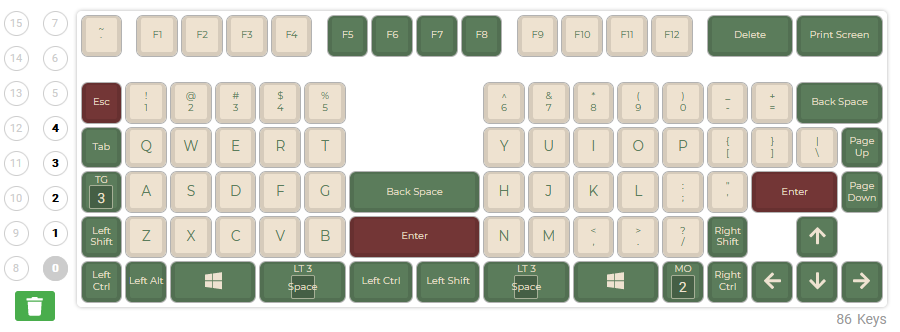

## QMK-config

### xbows_nature_layout_with_nav

A configuration that adds a new layer with cursor and mouse navigation.

0. Mac default layer:

1. Windows default layer:

2. Fn layer:

3. Mac nav layer:

4. Windows nav layer:

Links:
- [QMK Configurator](https://config.qmk.fm/#/xbows/nature/LAYOUT)
- [How to flash X-Bows QMK firmware](https://x-bows.com/blogs/blog/how-to-use-qmk-keyboard)
- [Description of layer toggles](https://blog.splitkb.com/how-to-work-with-small-keyboards)
